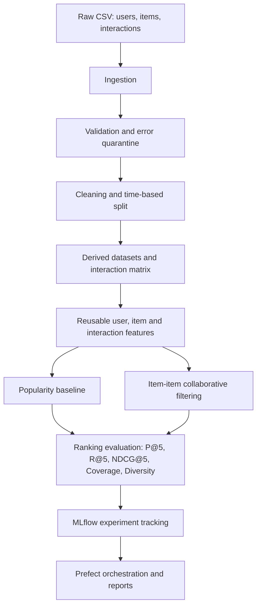

# Pipeline Architecture

```mermaid
flowchart TD
    A[Raw CSV: users, items, interactions] --> B[Ingestion]
    B --> C[Validation and error quarantine]
    C --> D[Cleaning and time-based split]
    D --> E[Derived datasets and interaction matrix]
    E --> F[Reusable user, item and interaction features]
    F --> G[Popularity baseline]
    F --> H[Item-item collaborative filtering]
    G --> I[Ranking evaluation: P@5, R@5, NDCG@5, Coverage, Diversity]
    H --> I
    I --> J[MLflow experiment tracking]
    J --> K[Prefect orchestration and reports]
```
